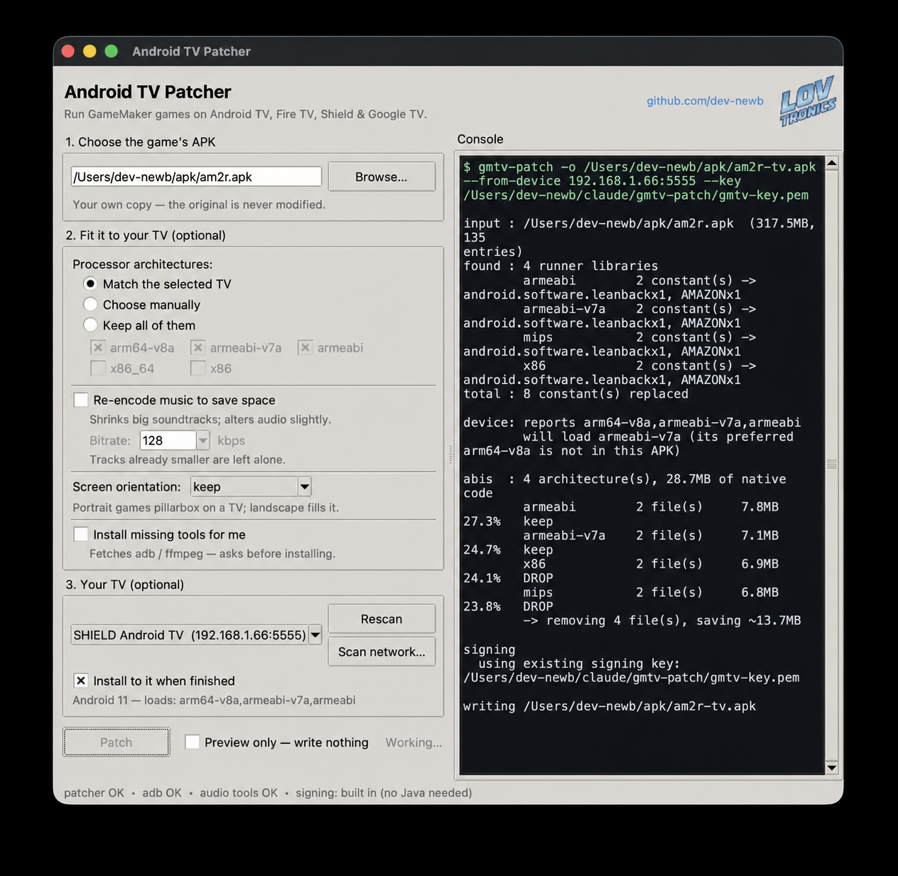

# gmtv-patch

Make a **GameMaker** Android APK run on **Android TV** (NVIDIA Shield, Fire TV,
Google TV, Bravia). Handles both eras: 1.4-era exports with deflated libraries and v1
signatures, and modern ones with stored page-aligned libraries, v2 signatures and
`targetSdk 35`.

Ships no game data and no GameMaker runtime — it patches a copy you already have.



*The desktop app mid-run — options on the left, the patcher's live output on the right. There is a command-line version too.*

## The problem

GameMaker Studio 1.4 games refuse to start on Android TV devices, dying on the title
screen or at boot with:

```
FATAL ERROR in
action number 1
of <Unknown Event>
for object oTestKeys:

Incorrect Android target... this executable targets Android TV devices.
This build is for Android
```

This has been an open question for years. The two places people asked:

- [XDA, Nov 2018](https://xdaforums.com/t/help-request-am2r-game-dont-work-on-android-tv-how-to-fool-it.3872253/) —
  three posts, all by the person asking, **zero replies**, ending "So no solution? :/"
- [GameMaker Community, 2017](https://forum.gamemaker.io/index.php?threads/apk-does-not-work-on-nvidia-shield-solved.26994/) —
  marked `[solved]`, but the solution is *rebuild the project* on GMS 1.4.1657 (pre-Gradle).
  Russell Kay of YoYo Games confirms in-thread: "1.x does not support Android TV but 2.x does."

Both documented fixes need the original project. Neither helps if you have only an APK.

## Why everyone was stuck

The check is **not in `AndroidManifest.xml`**. That is where people looked — hunting for
`leanback` intent filters, OUYA/TV categories, `uses-feature` entries — and it is why
generic "Android TV-ify an APK" repackagers don't help either. Those add launcher banners
and leanback categories, so the app *appears* in the TV launcher and then dies exactly as
before.

The gate is compiled into the native runner, `lib/<abi>/libyoyo.so`. The runner calls:

```java
PackageManager.hasSystemFeature("android.software.leanback")
```

and if the device says yes (or `Build.MANUFACTURER` is `AMAZON`), it concludes it is on a
TV and refuses, because the package was built for the plain `Android` target.

It also fires more than once, from different game objects — first at boot, later from
others — so it is not a single startup check you can step past.

## The fix

The gate has **two** conditions OR'd together:

```c
isTV = hasSystemFeature("android.software.leanback")  ||  Build.MANUFACTURER == "AMAZON"
```

You can read them straight out of `.rodata`, in order:

```
android.software.leanback          <- condition 1
android.software.leanback = %d     <- log format
android/os/Build
MANUFACTURER
Ljava/lang/String;
MANUFACTURER = %s                  <- log format
AMAZON                             <- condition 2
```

Both are neutralised by corrupting the constant so the comparison can never match:

```
android.software.leanback  ->  android.software.leanbacz
AMAZON                     ->  AMAZOZ
```

`hasSystemFeature()` finds nothing, `MANUFACTURER` never equals `AMAZOZ`, the runner
concludes it is on an ordinary Android device, and the game boots. Each replacement is
the same length as its original, so nothing shifts — no offsets, no relocations, no code
changes. **Two bytes per ABI.**

Patching only the first condition is enough for Shield and Bravia but leaves **Amazon
Fire TV still blocked** — Fire devices report the leanback feature inconsistently, which
is presumably why YoYo added the explicit vendor check.

**Only whole strings are touched** — a constant is rewritten only if it is both
NUL-terminated and NUL-preceded. That precision matters twice over:

- `"android.software.leanback"` also appears inside the log format string
  `"android.software.leanback = %d\n"`, which is left alone
- `"AMAZON"` must not be confused with the unrelated GameMaker OS constant `"os_amazon"`

Leaving both format strings intact preserves the diagnostics that tell you the patch
worked:

```
I/yoyo: android.software.leanback = 0      <- 0 means the patch is live
I/yoyo: MANUFACTURER = NVIDIA
```

## This is not an AM2R problem

The gate lives in YoYo's runner, so it hits **any** GameMaker 1.4 game exported to the
Android target. The clearest proof is the object name in the crash — the error is
attributed to whatever GML object happens to be executing, which differs per game while
the message stays identical:

```
AM2R              ... for object oTestKeys:   Incorrect Android target...
Spelunky Classic HD ... for object obatintro: incorrect android target...
```

Same gate, different games. Documented reports, none of them AM2R:

| Game / reporter | Where | What happened |
|---|---|---|
| **Spelunky Classic HD** (yancharkin) | [itch.io](https://itch.io/t/154069/android-tv) | Player reported the exact error on a Shield TV. The developer replied that the error gave too little to go on and they couldn't investigate further. Still unresolved. |
| **COWCAT**'s game (commercial dev) | [GameMaker forum](https://forum.gamemaker.io/index.php?threads/apk-does-not-work-on-nvidia-shield-solved.26994/) | "An NVidia Shield player just reported the same error message for my game. I also compiled with the latest (1.4.1772)." |
| **JRLS**'s game | same thread, 2017 | The original report. Only fixed by reinstalling the ancient GMS 1.4.1657 and rebuilding. |
| **AM2R** | [XDA, 2018](https://xdaforums.com/t/help-request-am2r-game-dont-work-on-android-tv-how-to-fool-it.3872253/) | Three posts, zero replies, unresolved for years. |

A related casualty is **[Grid Run](https://goncalomb.itch.io/gridrun)** (goncalomb), abandoned
on Android for the underlying reason: *"GameMaker: Studio 1.4 does not support these new
requirements (and never will), the Grid Run will never return to the Play Store."* Games
in this position are frozen at their last 1.4 build — exactly the population this tool
serves, because nobody is going to rebuild them.

The pattern is consistent: the developer usually can't reproduce it (no Android TV on the
desk), the only official fix is rebuilding the whole project on a different GameMaker
version, and so the report is closed with a shrug. Patching the shipped APK sidesteps all
of that.

## Modern APKs: stored libraries and v2 signatures

Newer GameMaker exports differ from 1.4-era ones in two ways that will break a naive
patcher. Both are handled automatically.

**Native libraries are stored, not deflated.** Modern APKs set
`extractNativeLibs="false"` so Android can mmap `.so` files straight out of the archive.
Re-compressing them fails the install with:

```
INSTALL_FAILED_INVALID_APK: Failed to extract native libraries, res=-2
```

So the original storage method is preserved, and STORED `.so` entries are **page-aligned
to 4096** (4 bytes for anything else) — the same thing `zipalign -p` does.

**v1 signatures are no longer sufficient.** Android requires APK Signature Scheme v2 (or
newer) for `targetSdk >= 30`; a v1-only package is rejected with:

```
INSTALL_PARSE_FAILED_NO_CERTIFICATES: No signature found in package of version 2 or newer
```

`gmtv_sign_v2.py` implements v2 in pure Python: the two-level chunked SHA-256 over the
three APK regions, an APK Signing Block inserted before the central directory, and the
EOCD's central-directory offset rewritten to match. It is applied automatically when
`targetSdk >= 30` or the input already had a v2 block.

One trap worth recording, because Android's error message names it precisely: `digests`
and `signatures` are *length-prefixed sequences of length-prefixed records* — two levels
of length prefix, not one. Getting it wrong yields
`Failed to parse signature record #2: Remaining buffer too short`.

## Games confirmed working

| Game | Engine era | Result |
|---|---|---|
| **AM2R 1.5.2** | GMS 1.4, v1, deflated libs | runs; controller support built in |
| **Grid Run 1.1.0** | GMS 1.4, targetSdk 26 | runs; `--orientation landscape` fills a 16:9 TV properly; touch-only, wants a mouse |
| **Spelunky Classic HD 1.2.2** | targetSdk 35, v2, stored libs | runs; **full GAMEPAD CONFIGURATION menu**, plus on-screen touch controls |

Two of the three already had working controller support — the TV gate was the only thing
preventing anyone from ever reaching it.

## Verified on

| Device | Android | Result |
|---|---|---|
| NVIDIA SHIELD Android TV (2017, `mdarcy`) | 11 | runs — **all three games**, AM2R at 59.8 fps |
| Sony BRAVIA 4K VH2 | 12 | runs |
| Chromecast with Google TV 4K (`sabrina`) | **14** | runs — incl. pure-Python signature |
| Amazon Fire TV | — | **untested** — the `AMAZON` fix is derived from the binary, not confirmed on hardware |

One patched APK covers all of them; there is no per-device variant. Differences in
package *size* (stripping unused ABIs, re-encoding audio) are storage decisions for a
particular device, not different patches.

## Usage

```bash
python3 gmtv-patch.py YourGame.apk
```

Writes `YourGame-tv.apk`, signed and ready to sideload.

```
  -o, --output FILE       output path (default: <name>-tv.apk)
      --key FILE          signing key (PEM), created if missing; defaults to
                          gmtv-key.pem beside the script
      --new-key           sign with a fresh key — a SEPARATE app, saves not kept
      --dry-run           report what would change, write nothing

      --list-devices      list the TVs adb can currently see, then exit
      --scan-network      sweep the LAN for TVs with wireless debugging, then exit
      --install [SERIAL]  install to a connected TV when finished
      --install-only      install an already-patched APK, skipping the patch —
                          retry a failed upload without repacking 300MB

      --list-abis         show the architectures inside, and what each one costs
      --abis LIST         KEEP only these ABIs (e.g. armeabi-v7a,armeabi)
      --drop-abis LIST    REMOVE these instead (e.g. mips,x86) — excludes --abis
      --from-device [SER] ask a connected TV over adb which ABIs it can load,
                          keep those, drop the rest

      --shrink-audio [K]  re-encode Ogg music to K kbps (default 128)
      --orientation X     landscape | portrait | both — rewrite screen orientation

      --install-adb       offer to install adb via this platform's package manager
      --install-ffmpeg    offer to install ffmpeg the same way
  -y, --yes               answer yes to the install prompt (scripts / CI)
```

`--abis`, `--drop-abis` and `--list-abis` need no extra tools. `--from-device`,
`--install`, `--list-devices` and `--scan-network` need `adb`; `--shrink-audio` needs
`ffmpeg` or `vorbis-tools`.

**The CLI and the desktop app do the same things.** `--install` carries the same two
recoveries the GUI has: it works around the Play Protect verifier, and when the TV is
full it offers to clear cached files and retries. It asks first, and declines rather
than assuming yes when stdin is not a terminal. Neither front end touches app data —
on a 4 GB TV that is mostly save files.

```bash
python3 gmtv-patch.py --scan-network                    # find TVs on the network
python3 gmtv-patch.py Game.apk --from-device --install  # fit it, then install it
```

## Making it fit (optional)

Some TVs have very little free space — a Sony BRAVIA VH2 had **382 MB free on a 4 GB
partition**, and Android needs roughly twice the APK size during a streamed install. Two
flags address that without touching a single one of the user's own apps:

```bash
python3 gmtv-patch.py AM2R.apk --abis armeabi-v7a,armeabi --shrink-audio 128
```

```
abis  : keeping ['armeabi', 'armeabi-v7a'], dropping ['mips', 'x86'] (4 files, ~13.7MB)
audio : re-encoding to ~128k
  encoder: oggdec | oggenc
  46/46 tracks re-encoded at ~128k: 231.9MB -> 64.9MB
done: 136.8MB      (from 317.5MB, in ~20s)
```

### Widescreen: fixing portrait phone games

Many GameMaker games were built portrait-only for phones. On a 16:9 TV they pillarbox
into a narrow strip down the middle. GameMaker stores orientation as four `<meta-data>`
ints in the manifest (`-1` = allowed, `0` = not), so flipping them is a **same-size edit**
— no string-pool surgery, nothing downstream shifts:

```bash
python3 gmtv-patch.py GridRun.apk --orientation landscape
```

```
orient: portrait -> landscape
        OrientLandscape          0 -> -1
        OrientPortrait           -1 -> 0
        OrientLandscapeFlipped   0 -> -1
        OrientPortraitFlipped    -1 -> 0
```

The result is better than expected: GameMaker **rebuilds the view for the new aspect**
rather than stretching it, and the game re-lays out its own UI. Verified on Grid Run — a
360x640 portrait game — which went from pillarboxed to genuine full-screen widescreen on a
Google TV Streamer, with correct proportions and no distortion.

Implemented in `gmtv_axml.py`, a deliberately minimal binary-AXML editor that does exactly
this one operation. No apktool, no JDK.

## Removing architectures

A GameMaker 1.4 APK ships native code for every ABI it was built for, and a given device
loads exactly one of them. The rest is dead weight you can delete. Start by seeing what is
in there and what each costs:

```bash
python3 gmtv-patch.py AM2R.apk --list-abis
```

```
abis  : 4 architecture(s), 28.7MB of native code
        armeabi        2 file(s)     7.8MB   27.3%   keep
        armeabi-v7a    2 file(s)     7.1MB   24.7%   keep
        x86            2 file(s)     6.9MB   24.1%   keep
        mips           2 file(s)     6.8MB   23.8%   keep

  What these are:

    armeabi-v7a  --  keep
          32-bit ARM with hardware floating point. The workhorse of the 2010s,
          from the Nexus One era onward. This is the one most Android TV boxes and
          TVs actually load from a 32-bit-only APK like this -- both the NVIDIA
          Shield and Sony BRAVIA run it.

    armeabi  --  usually safe to drop
          ARMv5TE with software floating point -- Android's launch-era baseline,
          roughly 2008-2011. Removed from the Android NDK in r17 (2018). ...

    x86  --  drop unless you use an emulator
          32-bit Intel Atom. Briefly shipped in phones such as the Motorola Razr i
          (2012) and Asus ZenFone 2 (2015) before Intel left the mobile market in
          2016. ...

    mips  --  safe to drop
          MIPS. Never caught on in consumer Android -- a handful of budget tablets
          and set-top boxes. Removed from the Android NDK in r17 (2018).

  Check what your device needs:
      adb shell getprop ro.product.cpu.abilist
```

Each architecture present gets a verdict and a sentence or two of context — what era of
hardware used it, the best-known devices that shipped it, and whether it is dead — so
"can I delete this?" is answerable without going and looking it up. `arm64-v8a` and
`x86_64` are covered too, for APKs that carry them.

Then remove what you don't need — either form works, whichever reads better to you:

```bash
--drop-abis mips,x86              # remove these
--abis armeabi-v7a,armeabi        # or equivalently, keep only these
```

They are mutually exclusive, and the selection is validated **before** anything is
written, so `--dry-run` catches mistakes:

- naming an ABI the APK doesn't contain → error, listing what *is* present
- selecting a set that would remove every ABI → refused, since that leaves an APK with no
  native code at all
- passing both flags → error

Neither needs any extra tools; it is pure zip surgery. Note `mips` was discontinued by
Google years ago and `armeabi` is pre-2012 — on anything modern, `--drop-abis mips,x86`
is usually free money.

`--shrink-audio` is where the real win is: AM2R ships 46 music tracks at **~500 kbps**,
which is **76% of the entire APK** and far beyond what a 2D game needs. Re-encoded tracks
stay 44.1 kHz stereo Vorbis and are stored uncompressed in the zip (Ogg is already
compressed, so deflating it is wasted work). This *is* a real change to the game's audio —
lossy re-encoding of already-lossy source — so it is opt-in, never automatic.

### Encoder availability

**No platform ships an Ogg Vorbis encoder by default.** Unlike MP3 and AAC, Vorbis has no
OS-level codec on macOS, Windows, or a stock Linux desktop — macOS's built-in `afconvert`
cannot produce it, and neither can Windows Media Foundation. Even installing `ffmpeg` is
not a guarantee: many builds omit `libvorbis` (Homebrew's did, on the machine this was
developed on).

So the tool probes, in order of quality, and tells you exactly what to install if it finds
nothing:

| # | Method | Notes |
|---|---|---|
| 1 | `ffmpeg` + `libvorbis` | best quality; absent from many ffmpeg builds |
| 2 | `oggdec \| oggenc` | vorbis-tools. `oggenc` cannot read Ogg, hence the `oggdec` decode stage |
| 3 | `ffmpeg` native `vorbis` | experimental (`-strict -2`), less efficient, but built into essentially **every** ffmpeg |

Method 3 is the safety net that makes this practical: anyone who has ffmpeg at all can use
`--shrink-audio`, whether or not their build includes `libvorbis`. It costs some size.

Measured on one track, both asked for `-b:a 128k`:

| | file | actual bitrate | 16–20 kHz vs source |
|---|---|---|---|
| `oggenc` | 1,076,717 B | 106.4 kbps | −2.1 dB |
| native | 1,313,715 B | 129.8 kbps | −3.6 dB |

Below 16 kHz both are within ±0.6 dB of the source — inaudible on TV speakers. The real
difference is efficiency: native needs ~22% more bits and still tracks the source slightly
less closely. Across all 46 tracks that is roughly 65 MB vs 79 MB, which matters when the
whole point is fitting a tight partition.

```
macOS    brew install ffmpeg          (or: brew install vorbis-tools)
Linux    sudo apt install ffmpeg      (or: vorbis-tools)
Windows  winget install Gyan.FFmpeg   (or scoop/choco install ffmpeg)
```

### Letting the tool install it

`--install-ffmpeg` offers to do that for you when no encoder is found:

```bash
python3 gmtv-patch.py AM2R.apk --shrink-audio 128 --install-ffmpeg
```

```
  No Ogg Vorbis encoder found on this system.
  winget is available and can install ffmpeg:

      winget install --id Gyan.FFmpeg -e --accept-source-agreements --accept-package-agreements

  Note: winget puts ffmpeg on PATH for NEW shells -- reopen your terminal
  afterwards, then re-run this command.

  Run it now? [y/N]
```

Detected per platform: **brew** (macOS), **winget → scoop → choco** (Windows),
**apt → dnf → pacman → zypper → apk** (Linux).

The rules it follows, because a tool that installs software deserves them:

- **Package managers only.** It never downloads a binary from a URL, and never
  bootstraps a package manager itself — no `curl | sh` to install Homebrew.
- **The exact command is printed before anything runs.** No hidden arguments.
- **It asks, and defaults to no.** `--yes` skips the prompt for CI.
- **It refuses to prompt when stdin isn't a terminal**, so a piped or scripted run can
  never silently install something. It errors and tells you to pass `--yes` instead.
- **`--dry-run` never installs and never encodes.**
- Linux commands are shown with `sudo` and run under it, so the password prompt is the
  system's own, not something this tool handles.

If no supported package manager is present it just prints the manual instructions and
stops.

Then:

```bash
adb connect <device-ip>:5555
adb uninstall <package>          # required: the new signature won't upgrade in place
adb install YourGame-tv.apk
```

Keep the generated keystore. Re-patching with the same key upgrades in place, no
uninstall and no lost saves.

## Requirements

- **Python 3.8+ and the `cryptography` package.** That is the whole hard requirement.
- **No JDK.** Both signature schemes are pure Python — v1 (JAR) in `gmtv_sign.py`,
  v2 (APK Signature Scheme v2) in `gmtv_sign_v2.py`.

```bash
git clone https://github.com/dev-newb/gmtv-patch.git
cd gmtv-patch
python3 -m venv .venv && .venv/bin/pip install -r requirements.txt
.venv/bin/python gmtv-patch.py YourGame.apk --dry-run
```

The virtualenv is not stylistic: macOS and most current Linux distributions refuse
`pip install` into the system Python (PEP 668, *externally-managed-environment*).
And `cryptography` is not optional — a patched APK will not install until it has
been re-signed, so signing runs on every patch, not just on some flag.

Optional, only for optional features:

| Tool | Needed for | If missing |
|---|---|---|
| `adb` | `--from-device`, installing to a TV | `--install-adb` offers to install it |
| `ffmpeg` / `vorbis-tools` | `--shrink-audio` | `--install-ffmpeg` offers to install it |

## Signing

Every patched APK must be re-signed, because changing one byte invalidates the original
signature. This used to shell out to the JDK's `jarsigner`; it is now pure Python, which
removes the single worst dependency for non-technical users — nobody has a JDK, and
telling them to install one loses them.

The implementation writes the three v1 signature files:

```
META-INF/MANIFEST.MF   per-entry SHA-256 of the *uncompressed* content
META-INF/CERT.SF       SHA-256 of the manifest, and of each manifest section
META-INF/CERT.RSA      detached PKCS#7 signature over CERT.SF
```

The fiddly parts, all handled: CRLF line endings, a blank line terminating every section,
no line exceeding 72 bytes (longer ones wrap with a leading space), and each section's SF
digest covering that section's *exact* bytes including its trailing blank line.

Digests are computed by streaming, so a 300 MB archive never lands in memory at once.
After writing, the tool re-opens the finished APK, recomputes every digest, and compares
against what it claimed — a real self-check, not a formality.

v2 is a different scheme entirely and is applied automatically when the app needs it —
see [Modern APKs](#modern-apks-stored-libraries-and-v2-signatures).

**How it is verified:**

1. **Android's own installer**, which is the verifier that actually matters. Patched
   APKs install and run on four devices from Android 11 to 14, including a
   `targetSdk 35` package the platform rejects outright unless the v2 block parses
   exactly right.
2. **The per-run self-check** above, which catches a bad manifest or a bad zip write
   before the file ever reaches a TV.
3. **In-place upgrades.** Re-patching with the same key installs *over* the previous
   build with no uninstall — which is what preserves save files.

Not checked against `jarsigner`: the whole point was to stop needing a JDK, and there is
no Java runtime on the machine this was built on.

The key is a single PEM (`gmtv-key.pem`, key + self-signed cert) created on first run.
Keep it: same key means in-place upgrades; a new key forces an uninstall and loses saves.

## Desktop app

`gmtv_gui.py` is a Tkinter front end covering everything the CLI does. Standard library
only, so a PyInstaller bundle needs no extra runtime, and it *imports* the patcher rather
than shelling out to `python3` — once frozen there is no interpreter on the user's PATH
to call.

**It finds your TV for you.** The dropdown lists whatever `adb` already knows about.
**Scan network…** goes further: it sweeps the local subnets on port 5555 and queries
mDNS, so a TV that was never paired still turns up, and connects it. Picking one fills in
its Android version and the ABIs it can load — then **Match the selected TV** trims the
APK to exactly those, which is the difference between a 317 MB install and a 137 MB one.

**The console is the real thing.** The right-hand pane is the patcher's actual output
streamed live, not a progress bar — every constant replaced, every architecture kept or
dropped with what it costs, the signing self-check. Drag the divider to give either side
more room.

**Install to it when finished** hands the result straight to `adb install` on the
selected TV. **Preview only** runs the whole thing and writes nothing, so you can see
what a patch would do before committing to it.

Build a standalone app:

```bash
pyinstaller --onefile --windowed --name "Android TV Patcher" \
    --add-data "gmtv-patch.py:."   --add-data "gmtv_sign.py:." \
    --add-data "gmtv_sign_v2.py:." --add-data "gmtv_axml.py:." \
    --add-data "gmtv_scan.py:."    --add-data "assets:assets" \
    gmtv_gui.py
```

The result is one file the user double-clicks. No Python, no Java, nothing to install.

## Notes

- Patches **every** ABI present (`armeabi`, `armeabi-v7a`, `mips`, `x86`), so x86 Android
  TV boxes and emulators are covered too.
- Untouched entries are copied as **raw compressed bytes** rather than recompressed. A
  318 MB APK repacks in about 20 seconds, and every non-runner entry stays byte-identical
  to the input.
- Old `META-INF/` signatures are dropped and replaced. GameMaker 1.4 packages target old
  SDKs, so a v1 (JAR) signature is accepted. SHA-256 is used because modern JDKs refuse
  to sign with SHA-1.
- **Install failing with `INSTALL_FAILED_VERIFICATION_FAILURE`?** Play Protect rejects
  re-signed sideloads silently, with no prompt on screen. Turn it off (Play Store →
  Settings → Play Protect), install, then turn it back on.

## What this does not fix

- **Controller support on the title screen.** Some games gate "touch to start" on a real
  touch event. The rest of the game may be fine on a gamepad.
- **On-screen touch controls.** Games that auto-hide them when a controller is detected
  behave correctly; others keep drawing them. Whether that matters depends on the game,
  not on this patch: Spelunky Classic HD is not touch-only — it has a **GAMEPAD
  CONFIGURATION** menu, and its touch pad is one input option among several, with its own
  size, offset and visibility settings. Grid Run is the genuinely touch-only one.
- **32-bit only.** GameMaker 1.4 never shipped an arm64 runner, so these games run under
  32-bit ARM translation on modern devices. Not patchable — needs a rebuild.
- **Launcher placement.** No `LEANBACK_LAUNCHER` category or TV banner is added, since
  that means rebuilding resources. Launch from the "sideloaded apps" area, or use a
  separate banner tool.

## Legal

This tool contains no copyrighted game content and no GameMaker runtime. It modifies a
file you supply.

Whether you may *redistribute* a patched APK is an entirely separate question, and for
most games the answer is no — the GameMaker runtime inside is proprietary to YoYo Games,
and the game itself is its author's (or, for fan games, someone else's IP altogether).
Patch your own copy; don't hand out the result.
